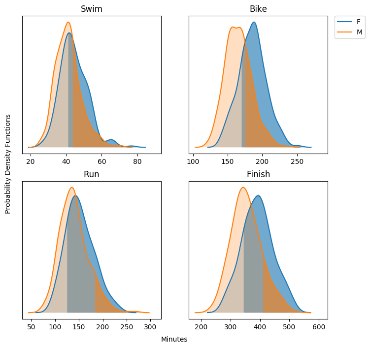

Triathlon Percentile Assessment
===============================

Assesses the percentile value of a Kernel Density Estimate of race times for triathlon data.
Creates a plot with the shaded percentile region as well as printint out the percentile value.

An example print out is given here



As well as the following print out.

``` shellsession
F	swim	0.6555345156508794
M	swim	0.35056101736793244
F	bike	0.7797914411559579
M	bike	0.30546631476329744
F	run	0.8063036088120178
M	run	0.09738989401592144
F	finish	0.8027271352137116
M	finish	0.15131064396573427
```

Keep in mind that it is left to the reader to ensure that the input tabular data from their source
is of the right format.

NOTE
====

This repository is mostly for personal use, as such you may find it is written in a somewhat highly
specific manner. To generate percentile values not from SportStat tracked races or for one
discipline of triathlon in general hacking may be required. It is the hope of the author however
that this removes much of the more complicated portion of generating percentile plots and values
for whatever race future developers would like to use this for.
